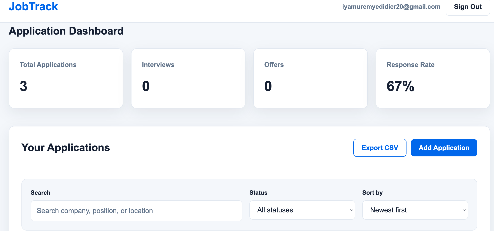
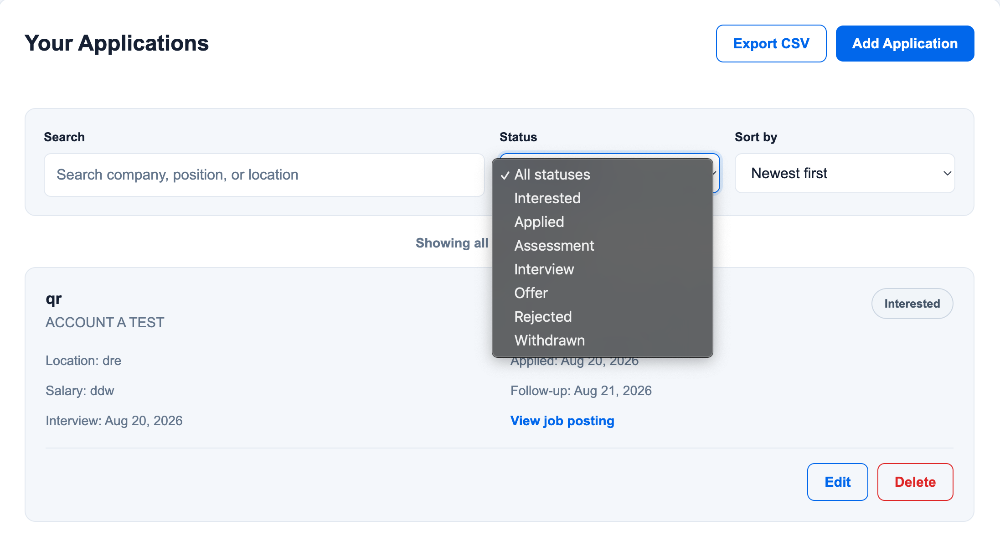
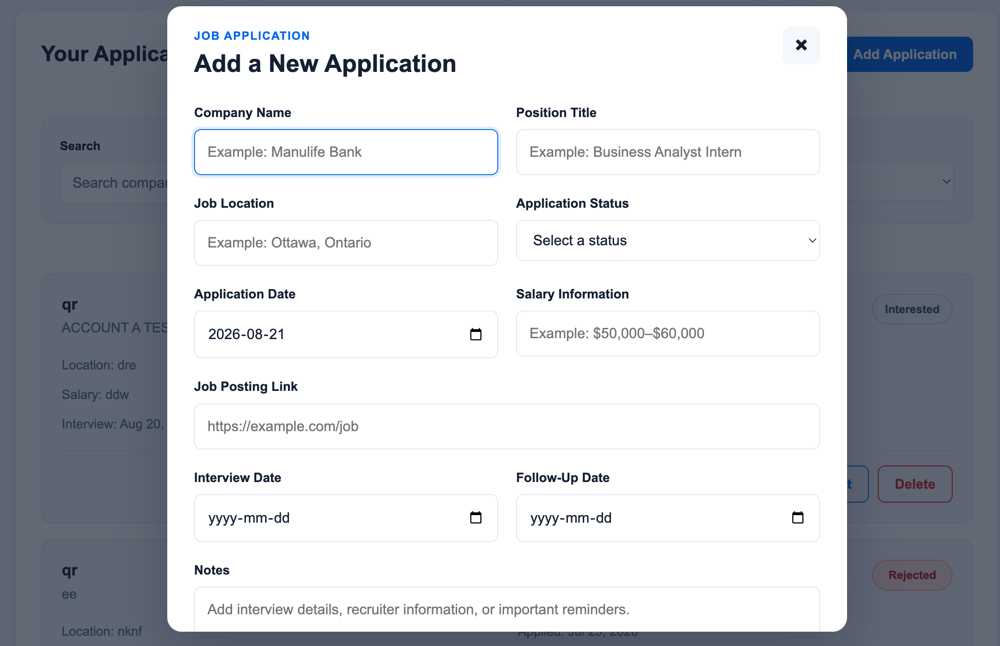

# JobTrack — Job Application Tracker

JobTrack is a responsive web application designed to help job seekers organize and manage their job search in one place.

Users can create an account, securely sign in, track applications, manage interviews and follow-ups, monitor application status, and export their data.

## Live Application

https://iyadidier.github.io/job-application-tracker/

## Screenshots

### Dashboard



### Applications



### Add Application



## Features

- User account registration
- Email confirmation
- Secure sign in and sign out
- Forgot-password and password-reset flow
- Private user-specific job applications
- Add new applications
- Edit existing applications
- Delete applications
- Search applications
- Filter by application status
- Sort applications
- Application status colour indicators
- Dashboard statistics
- Response rate calculation
- Interview tracking
- Offer tracking
- Follow-up date tracking
- Notes and salary information
- Job posting links
- CSV export
- Responsive layout
- Success and error notifications

## Security

JobTrack uses Supabase Authentication and PostgreSQL Row Level Security.

Each authenticated user can only access their own job application records.

The application was tested using two separate user accounts to verify that application data remains isolated between users.

## Technologies Used

### Front End

- HTML5
- CSS3
- JavaScript

### Back End and Database

- Supabase
- PostgreSQL
- Supabase Authentication
- Row Level Security

### Development and Deployment

- Git
- GitHub
- GitHub Pages
- Visual Studio Code

## Application Statuses

Applications can be tracked using the following statuses:

- Interested
- Applied
- Assessment
- Interview
- Offer
- Rejected
- Withdrawn

## Dashboard Metrics

The dashboard displays:

- Total Applications
- Interviews
- Offers
- Response Rate

## Database

Job application information is stored in a PostgreSQL database using Supabase.

Each application contains information such as:

- Company name
- Position title
- Job location
- Application status
- Application date
- Salary information
- Job posting URL
- Interview date
- Follow-up date
- Notes
- Created timestamp
- Updated timestamp

## Authentication

Users can:

1. Create an account
2. Confirm their email address
3. Sign in
4. Sign out
5. Request a password-reset email
6. Set a new password

## Data Export

Users can export their application records to a CSV file for use in tools such as:

- Microsoft Excel
- Google Sheets
- Power BI

## Local Development

Clone the repository:

```bash
git clone https://github.com/iyadidier/job-application-tracker.git